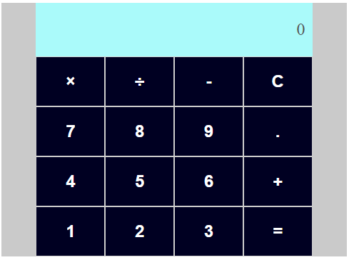

# Calculadora Simples

Este é um projeto de uma **calculadora** simples desenvolvida com **React**. A aplicação permite realizar as quatro operações matemáticas básicas: **soma, subtração, multiplicação e divisão**.
Projeto feito para o desafio de código durante o bootcamp de React da dio.me.

## 🚀 Tecnologias Utilizadas

- **React** (v18.3.1)  
- **Styled Components** (v6.1.13)  
- **React Scripts** (v5.0.1)  
- **Testing Library** para testes automatizados

## 📦 Dependências

```json
{
  "react": "^18.3.1",
  "react-dom": "^18.3.1",
  "react-scripts": "5.0.1",
  "styled-components": "^6.1.13",
  "@testing-library/react": "^13.4.0",
  "@testing-library/jest-dom": "^5.17.0",
  "@testing-library/user-event": "^13.5.0",
  "web-vitals": "^2.1.4"
}
```

## 📂 Estrutura do Projeto

```
calculadora/
├── public/
├── src/
│   ├── components/  # Componentes da calculadora
│   ├── App.js       # Componente principal
│   ├── index.js     # Ponto de entrada do React
│   └── styles.js    # Estilização com Styled Components
├── package.json
└── README.md
```

## 🔧 Como Rodar o Projeto Localmente

1. **Clone o repositório:**

   ```bash
   git clone https://github.com/mauroimamura/calculadora-front.git
   cd calculadora-front
   ```

2. **Instale as dependências:**

   ```bash
   npm install
   ```

3. **Inicie a aplicação:**

   ```bash
   npm start
   ```

4. **Acesse no navegador:**

   ```
   http://localhost:3000
   ```

## 🖼️ Screenshots

  
*Exemplo de interface da calculadora*

## 🚀 Funcionalidades

- **Soma:** Adiciona dois números.
- **Subtração:** Subtrai o segundo número do primeiro.
- **Multiplicação:** Multiplica dois números.
- **Divisão:** Divide o primeiro número pelo segundo (exceto por zero).

## 🛠️ Melhorias Futuras

- Implementar operações em sequência.
- Implementar histórico de operações.

---

Desenvolvido durante o treinamento de React da dio.me, orientação de [Pablo Enrique](https://github.com/pablohdev).
